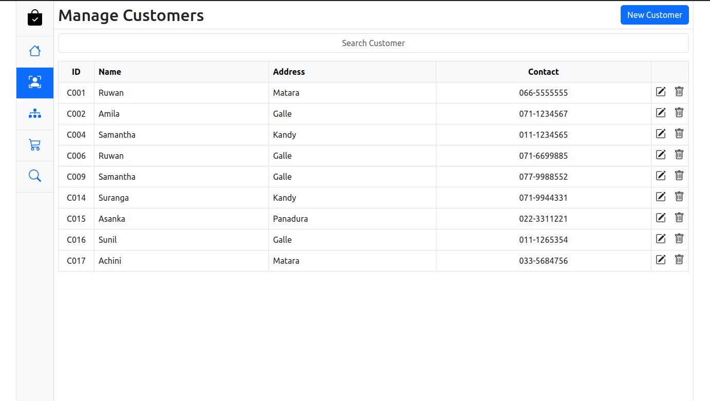
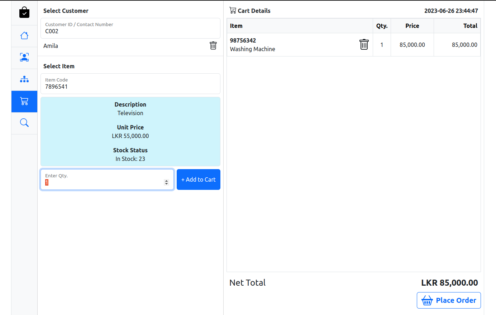
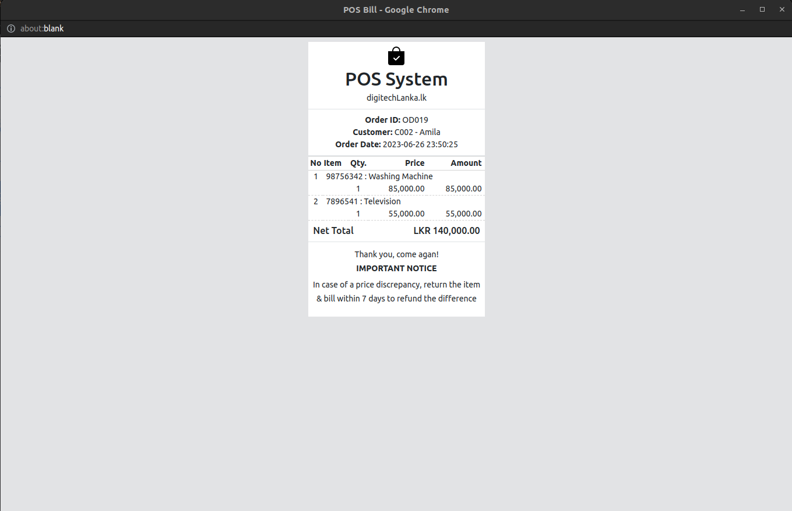

# <b>Point of Sale (POS) System</b>

<p align="center">
    
</p>
<p align="center">
    
</p>
<p align="center">
    
</p>

<p>This is a fully functional Point of Sale (POS) System web application developed using various technologies. In each release, you will
find that the back end technologies I've used for the application has been changed. 
<br><br>
The back end was first finished without applying any architecture and when I move forward the back end was well-structured with the help of
SOLID Design Principles and various Design Patterns. The ultimate goal was to implement the back end using Spring Boot.
</p>

## Technologies used
### Front-End
* HTML5
* CSS3
* EcmaScript
  * Modules
* Bootstrap
* Animate.CSS
* CSS Loaders
* js-joda
* big.js
* AJAX
* Web API
  * DOM API
  * XHR
  * LocalStorage
  * WebSocket
  * Intl
* jQuery
  * jQuery AJAX
* Client-side Reporting

### Back-End
Upto release: [Spring Web MVC + JDBC (v1.0.0)](https://github.com/SameeraWijerathne/pos-system/releases/tag/v.1.0.0)
* Java 11
* Java SE 11
* Spring Framework (Spring Web MVC)
* Spring Web Socket
* Apache DBCP
* Lombok
* Jackson
* Client-Server Architecture

Upto release: [Spring Framework + JDBC (v2.0.0)](https://github.com/SameeraWijerathne/pos-system/releases/tag/v2.0.0)
* Resource Oriented Architecture
* MVC Architecture
* Layered (MVC2, Extended MVC or n-tier) Architecture
* Model Mapper
* JUnit
* Swagger
* Logback & Slf4j
* Hibernate Validator

Upto release: [Spring Framework + Spring JDBC (v3.0.0)](https://github.com/SameeraWijerathne/pos-system/releases/tag/v3.0.0)
* Spring JDBC

Upto release: [Spring Boot Integration (v4.0.0)](https://github.com/SameeraWijerathne/pos-system/releases/tag/v4.0.0)
* Spring Boot

### Data-Base
* MySQL

## How to use this repository

* Open the terminal
* Then copy and paste the below command to clone the repo
```
git clone https://github.com/SameeraWijerathne/pos-system.git
```


<!-- CONTACT -->
## Follow me on LinkedIn

Sameera Wijerathne - [@LinkedIn](https://www.linkedin.com/in/sameerawijerathne/)